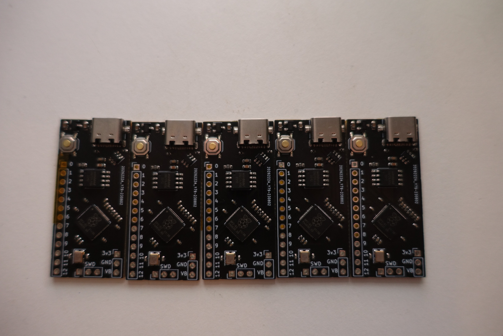

# RP2040-base-example
A simple dev board, created to test [RP2040-base](https://github.com/TT-392/RP2040-base)

Revision 0.9 was produced at jlcpcb. The rev number was bumped to 1.0 after the pcb was tested. There were no changes between rev 0.9 and 1.0. The production files in the "jlcpcb" folder are identical to the ones used to order the pcbs.

revision 0.9 of the pcb

# Tested functionality physical board rev 0.9 (identical to 1.0)
A sketch has been uploaded, which prints a string over cdc usb every second. This indicates working usb functionality, and working program memory.

# Notes
- jlcpcb has no basic part 27 ohm resistors, therefore, when ordering the test pcbs, the series termination resistors on the usb lines were replaced with 22 ohm ones (not too critical but not ideal)

# Known issues
- No thought was given to which IO pins should be exposed, no analog pins have been exposed.
- No debug LED.
- ground plane on top layer wasn't taken into account when calculating trace with for usb line impedance matching (not too critical but not ideal)

